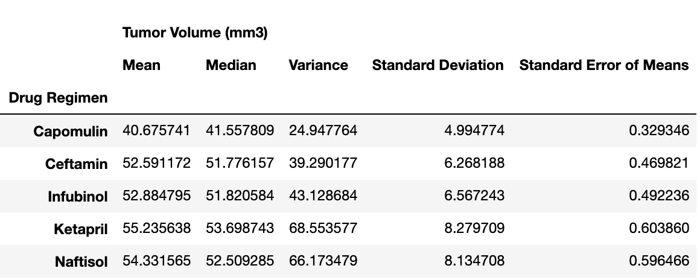
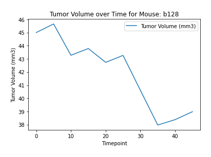

# Matplotlib_challenge

# Pymaceuticals Inc Study

---

A study was done on 249 mice identified with SCC tumor growth. The mice were treated with a variety of drug regimens over a course of 45 days. The purpose of this study was to compare the performance of Pymaceuticals' drug of interest, Capomulin, versus the other treatment regimens. The following report summarizes the analysis of the data resulting from this study.

### Summary Statistics Table
   Table of the mean, median, variance, standard deviation, and SEM of the tumor volume for each drug regimen.

### Bar Chart
Comparison of the number of total mice for each treatment regimen throughout the course of the study.

### Pie Chart
Compares the distribution of female or male mice in the study.

### Box and whisker Chart
Displays the final tumor volume for all four treatment regimens and highlight any potential outliers in the plot.

### Line Chart 
Displays the tumor volume vs. time point for a single mouse, that was treated with Capomulin.

### Scatter Chart
Displays distribution of average tumor volume versus mouse weight for the Capomulin treatment regimen. Also displays the linear regression model between mouse weight and average tumor volume for the Capomulin treatment. 
    

### Correlation Coefficient

The correlation coefficient between mouse weight and average tumor volume for the Capomulin treatment is **0.7088568047708717**

---

## Observation and Insights

1. Each drug had sample sizes of over 150 mice. This is a sufficient sample size to detect the effect of the drugs on the tumor volume.

2. There was an almost equal distribution of male and female mice. The results of the study were not affected since there was an almost equal disribution of male and female mice.

3. Capomulin was effective in reducing the volume of the tumor over the 45 day period. Ramicane was also equally effective, with Ramicane doing a slightly better job on average. Both drugs reduced the tumor volume by almost the same amount. In comparison, Infubinol and Ceftamin increased the tumor volume rather than reducing it. It would be interesting to continue the experiment to see if Capomulin and Ramicane would reduce the tumor volume and get rid of it entirely over time.

4. There is a definite correlation between the mouse weight and the average tumor volume. Researchers will have to consider the weight of the mice across the sample size to ensure that the results reflect the effect of the drug alone.

