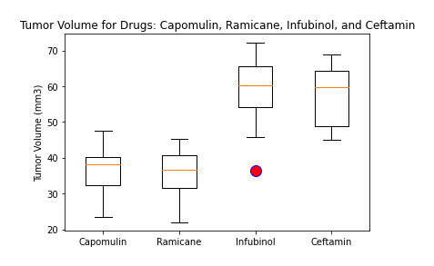
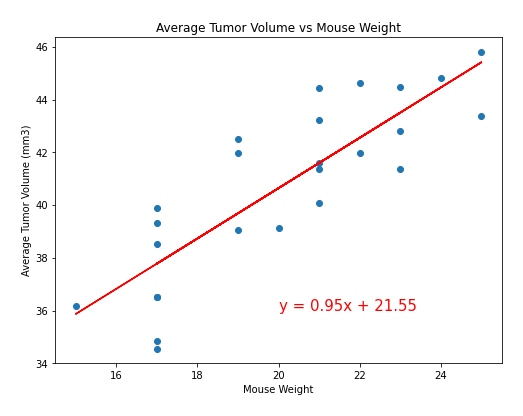

# Matplotlib_challenge

## Observation and Insights

* 1. Each drug had sample sizes of vver 150 mice.

* 2. There was an almost equal distribution of male and female mice. 

* 3. Capomulin was effective in reducing the volume of the tumor over the 45 Timepoint period. Ramicane was also equally effective, with Ramicane doing a slightly better job on average. Both drugs, on reduced the tumor volume by almost the same amount. In comparison, Infuubinol and Ceftamin increased the tumor volume rather than reducing it. It would be interesting to continue the experiment to see if Capomulin and Ramicane would reduce the tumor volume and get rid of it entirely over time.

* 4. There is a definite correlation between the mouse weight and the average tumor volume. Researchers will have to consider the weight of the mice and make sure that it is the same across thhe sample size to ensure that the results reflect the effect of the drug alone.
